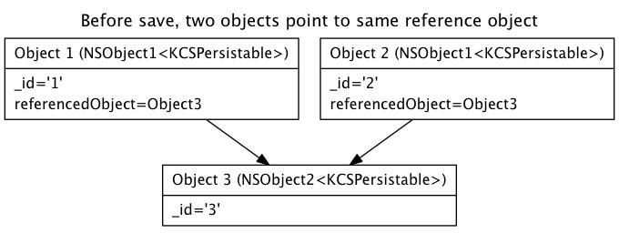

## Datatypes in KinveyKit
Not all object types are representable in Kinvey's back-end and thus are not saved when specified as a property of a `KCSPersistable` class. In general, only properties of JOSN-compatible types are persistable. This is done to make back-end cross-platform compatible and easy to parse. These considerations are similar to those when using `NSCoding`.

We've also provided built-in converters for common `Foundation` types (as specified in the table below). If you want to support other types, supply a proxy property (as described below). 

## Supported Types Table
Any property of the following classes will be persisted to the backend in the specified type. 

 Objective-C Type | Kinvey (JSON) Backend Type | Notes
|:-----------------------------------|-------------|----------
 NSNumber | number  (or `true`/`false` for BOOL)| 
 NSString | string | 
 NSArray\NSMutableArray | array | return type is always immutable
 NSDictionary\NSMutableDictionary | object | return type is always immutable 
 NSDate | ISO 8601 string | Kinvey string form is: `"ISODate("YYYY-MM-DDThh:mm:ss.sssZ")"`
 NSSet\NSMutableSet | array |
 NSOrderedSet\NSMutableOrderedSet | array |
 NSAttributedString\NSMutableAttributedString | string | Attributes are discarded upon saving; to save the attributes, convert to a persistable representation, such as an html string, or NSDictionary. 
 NSNull | null 

### Linked Objects
In addition to persisting objects directly into an entiy's fields, by saving/loading an object through a `KCSLinkedAppdataStore`, objects can be saved by reference. The linked object will be persisted to another location in the backend, and the field will contain a reference dictionary that will tell the `KCSLinkedAppdataStore` how to load that object.

 Objective-C Type | Notes 
|:------------|---
UIImage | Properties of UIImage are saved to the blob storage.
id&lt;KCSPersistable&gt; | Relational entities can be saved, preserving their relations. See the Relational Data section in the [iOS Developers Guide](http://docs.kinvey.com/ios-developers-guide.html)

**Warning:** If a property of a linked object type is mapped through -[KCSPersistable hostToKinveyPropertyMapping] and it is not saved through a `KCSLinkedAppdataStore`, it will cause an error when that object is serialized to JSON during the save operation. If an object had been previously saved in this way, the loaded value will be a NSDictionary with the reference information. Loading an object not through a `KCSLinkedAppdataStore` will assign the dictionary to the mapped property; the original object will not be resolved. Using the linked store will cause the reference to be resolved and the appropriate object will be created. 

#### Additional types
As of KinveyKit version 1.8, only `UIImage` blob types are treated this way. If you would like to see additional types supported, contact us at [http://www.kinvey.com/contact-2](http://www.kinvey.com/contact-2).

#### Limitations (v 1.8)
##### Saving Images
When saving images, if two objects share the same UIImage and are saved, the image will be saved to blob storage as two different images, with a different reference for each entity.

* To work around this, save the image using `KCSResourceService` and use a string location property instead of a UIImage one. 
   
For example,

*

After saving:

    [aKCSLinkedAppdataStore saveObject:@[object1, object2] withCompletionBlock:^{...} withProgressBlock^{...}];

In 'Objects' collection in Kinvey backend will look like:

'_id' | 'image'
|:---|---
'1'| {'_type':'resource','_mime-type':'image/png','_loc':'**blob-name-1**.png'}
'2'| {'_type':'resource','_mime-type':'image/png','_loc':'**blob-name-2**.png'}

Then, after loading:

    [aKCSLinkedAppdataStore loadObjectWithID:@[@"1",@"2"] withCompletionBlock:^{...} withProgressBlock^{...}];
    
Two separate UIImages will be loaded:

   
##### Saving Relational Data
* When saving related entities, if two objects have a reference to a same third entity, that third entity will only be saved once, and each of the two referring objects will have a reference to the same third object. However, when loading the two objects, they will have separate reference objects backed by the same entity. That is, the 3rd entity will exist as two separate objects in memory, even though they share same `_id` and data. Changing one in memory will not modify the other, but saving them will overwrite each others' changes. 

For example,

After saving:

    [aKCSLinkedAppdataStore saveObject:@[object1, object2] withCompletionBlock:^{...} withProgressBlock^{...}];

In 'Objects' collection in Kinvey backend will look like:

'_id' | 'referencedObject'
|:---|---
'1'| {'_type':'KinveyRef','_id':'3','_collection','Collection2'}
'2'| {'_type':'KinveyRef','_id':'3','_collection','Collection2'}

And in 'Collection2' the Kinvey backend will look like:

|'_id' |
|:---|
|'3' |

Then, after loading:

    [aKCSLinkedAppdataStore loadObjectWithID:@[@"1",@"2"] withCompletionBlock:^{...} withProgressBlock^{...}];
    
Two separate UIImages will be loaded:

*

* Linked objects are not compatible with offline saving. If an object is queued for offline save, only the object's data will be persisted to the backend when it is eventually saved; linked data will not be saved and the reference properties will be nulled. 
* Although reference entities are supported in NSSets and NSArray properties, these collections must be homogeneous in class and backing collection.

### Helpers
For some types, we don't want to automatically convert them. This may be due to preventing unintended side-effects, or the object types are less frequently used. 

Objective-C Type | KinveyKit Helper Methods | Backend Type 
|:---------------|------|--------
CLLocation (Core Location) | `- [CLLocation kinveyValue];`   `+ [CLLocation  locationFromKinveyValue:kinveyValue]` | array 

### Converting Other Object Types
You can use a proxy type to convert an object to a persistable type. This can be done by using a property that is persistable in `hostToKinveyPropertyMapping` and providing setter/getters that map the non-persistable object. For example, the following code substitutes a `NSArray` for a `CGRect`.

    // RectangleHolder.h
    @interface RectangleHolder : NSObject <KCSPersistable>
    @property (nonatomic) CGRect rect;
    @end
&nbsp;   

    // RectangleHolder.m
    @interface RectangleHolder ()
    @property (nonatomic, assign) NSArray* rectArray;
    @end
    @implementation RectangleHolder
    @synthesize rect;
    - (NSDictionary *)hostToKinveyPropertyMapping {
        return @{ @"rectArray" : @"kinveyRect"};
    }
    - (void) setRectArray:(NSArray *)rectArray {
        self.rect = CGRectMake([[rectArray objectAtIndex:0] floatValue], //x
                               [[rectArray objectAtIndex:1] floatValue], //y
                               [[rectArray objectAtIndex:2] floatValue], //w
                               [[rectArray objectAtIndex:3] floatValue]); //h
    }    
    - (NSArray*) rectArray {
        return @[@(self.rect.origin.x), @(self.rect.origin.y), @(self.rect.size.width), @(self.rect.size.height)];
    }
    @end