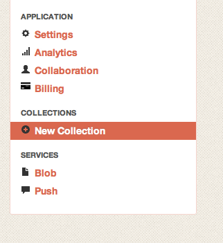

## How to Use OAuth 2 with Kinvey
This guide explains how to use OAuth 2.0 based services with Kinvey's Data Integration feature. You'll need to follow this guide in order to integrate your application with many 3rd party web services. 

## What is OAuth 2?
[OAuth 2.0](http://oauth.net/2/) is an open protocol to allow secure and controlled access to web services. As an application developer, services that provide HTTP APIs supporting OAuth 2.0, let you access parts of their service on behalf of your users. For example, when accessing a social network site, if your user gives you permission to access his account, you might be able to import pictures, friends lists, or contact information to your application. 

OAuth 2.0 is a still-evolving standard and implementations will vary between service providers. Be sure to read their developer documentation closely. 

### What web services support OAuth 2?
Many popular services such as Google, Instagram, Foursquare, Facebook, and GitHub use OAuth 2. A non-comprehensive list can be found at this [Wikipedia article](http://en.wikipedia.org/wiki/OAuth). To find out if your favorite web site provides an API that can be accessed with OAuth 2, look for a "Developers" or "API" link on the front page. 

## How do I Use OAuth 2?

### Getting a Client Key and Secret
The first step to register your application with the service provider. Doing this will provide you with the keys necessary to create the OAuth tokens. 

Make sure your application conforms to the individual API's Terms of Service. This may limit how the API is used, what kinds of applications can use it, how and where data is stored, and how often the API may be called. 

Here's an example using Instagram's API. Other services will follow the same steps for registering an application, but will look different, or use slightly altered terms, but the necessary information will be the same. 

1. Go to http://instagram.com/developer/
2. Click "Register Your Application"

    

3. Enter your "application name." For ease of use, we recommend re-using the same name you gave your app in the Kinvey console.
4. Most importantly with Instagram or any other service is the "redirect URI." This is specified as part of the OAuth protocol. What happens when you request an OAuth token is that that the caller will be asked to display a web page from the service so your user can log in. If that log in is successful, the "redirect URI" is the page that the user will be redirected to. When building a browser-based application this is needed to get the user back to your web site. 

    
Since we are building a native application, the user will never see the indicated, so it can be anything, even a garbage value. What's important is that we use the same value later in the code, in order to detect the redirect.

    

5. Once the registration is complete, you'll be presented with a summary. The most important information is the "Client ID" and the "Client Secret." Like Kinvey's "App Id" and "App Secret" these keys provide unique access credentials for your application. This can be used by the service for analytics, billing, terms of service enforcement, and to allow your user to revoke access to the service. 

	
	
### Adding OAuth2 to Your iOS KinveyKit Project
#### Adding the gtm-oauth2 library to the project
Obtaining an authorized OAuth 2 token is not a trivial task. In addition to the multiple specific HTTP requests to request access and obtain the token, you will also have to display a web page to the user for them to enter their credentials. You can implement this behavior yourself, or obtain open-source code that will handle the intricacies for you. In the following example we use popular the [GTM OAuth2](http://code.google.com/p/gtm-oauth2/) library from Google. 

1. You will need to download this project from Google Code using Subversion:

	svn checkout http://gtm-oauth2.googlecode.com/svn/trunk/ gtm-oauth2-read-only

2. Once you have a local copy of the project, you will need to add the following files to your project. In a new project you will have to link the `Security.framework` and `SystemConfiguration.framework`. However, if you've already added `KinveyKit.framework` to your project, then you will have already linked these frameworks, and don't need to do so again. 
   * HTTPFetcher/GTMHTTPFetcher.h
   * HTTPFetcher/GTMHTTPFetcher.m
   * Source/GTMOAuth2Authentication.h
   * Source/GTMOAuth2Authentication.m
   * Source/GTMOAuth2SignIn.h
   * Source/GTMOAuth2SignIn.m
   * Source/Touch/GTMOAuth2ViewControllerTouch.h
   * Source/Touch/GTMOAuth2ViewControllerTouch.m
   * Source/Touch/GTMOAuth2ViewTouch.xib

3. **ARC Projects Only** If you your project is using Automatic Reference Counting (ARC), you will need to provide special compiler flags for these files, since they are in the non-ARC style.  
    - In the Target Settings -> Build Phases -> Compile Sources section, add `-fno-objc-arc` in the "Compiler Flags" for each of the GTM files.
  
	

#### Using gtm-oauth2 to get the token information
1. The first thing to do is set up the authentication object. This will be an object of the `GTMOAuth2Authentication` class. This object tells the gm-oauth2 library how to authorize the token with your app id and app secret (remember those keys from above?). The token URL and scope are defined by the API. The client ID and secret are specific to your application and the API. 

    Make sure to also set the scope to what's required by the API. Different APIs provide different scope terms depending on the level of access you want the user to grant your app (ask for the minimum amount of access needed). In this case Instragram wants us to use 'basic' scope. 

    <pre>- (GTMOAuth2Authentication * ) authForInstagram
    {
        //This URL is defined by the individual 3rd party APIs, be sure to read their documentation
        NSString * url_string = @"https://api.instagram.com/oauth/access_token";
        NSURL * tokenURL = [NSURL URLWithString:url_string];        
        // We'll make up an arbitrary redirectURI.  The controller will watch for
        // the server to redirect the web view to this URI, but this URI will not be
        // loaded, so it need not be for any actual web page. This needs to match the URI set as the 
        // redirect URI when configuring the app with Instagram.
        NSString * redirectURI = @"http://goes-nowhere-does-nothing";
        GTMOAuth2Authentication * auth;
        auth = [GTMOAuth2Authentication authenticationWithServiceProvider:@"Instagram"
                                                                 tokenURL:tokenURL
                                                              redirectURI:redirectURI
                                                                 clientID:@"<#YOUR INSTAGRAM CLIENT ID#>"
                                                             clientSecret:@"<#YOUR INSTAGRAM CLIENT SECRET#>"];
        auth.scope = @"basic";
        return auth;
    }</pre>

2. Once the authorization object is set up, we need to actually give the user credentials over to the service and obtain an authorized token. In this section we leverage the `GTMOAuth2ViewControllerTouch` class to present a web view to get the user credentials and return to us a valid token. When the delegate method `viewController:finishedWithAuth:error:` is called, we'll either have a validated token or an error, and we'll be ready to use the service. 

    
For this to work, the we need a `UINavigationController` to push the auth controller. This may require a different set up in your app code or storyboard. If this flow does not work in your app, as a workaround, you can init a new `UINavigationController`, present it in modally in the current view controller, and push the auth controller onto that navigation controller. You'll then have to dismiss it differently in your `viewController:finishedWithAuth:error:` method.

    <pre>- (void)signInToInstagram
    {
        GTMOAuth2Authentication * auth = [self authForInstagram];  
        NSString* auth_string = @"https://api.instagram.com/oauth/authorize";
        NSURL * authURL = [NSURL URLWithString:auth_string];
        // Display the authentication view
        GTMOAuth2ViewControllerTouch * viewController;
        viewController = [[GTMOAuth2ViewControllerTouch alloc] initWithAuthentication:auth
                                                                     authorizationURL:authURL
                                                                     keychainItemName:kKeychainItemName
                                                                             delegate:self
                                                                     finishedSelector:@selector(viewController:finishedWithAuth:error:)];
        [self.navigationController pushViewController:viewController animated:YES];
    }</pre>
    
3. Once the callback is called, the `auth` object will be valid and ready for use by the app or there will be an error. For the rest of the example, I will leave gtm-oauth2 behind and just the authorized token string for use with the backend. The string can be obtained with the `- [GTMOAuth2Authentication accessToken]` method. 
    <pre>- (void)viewController:(GTMOAuth2ViewControllerTouch * )viewController
          finishedWithAuth:(GTMOAuth2Authentication * )auth
                     error:(NSError * )error
    {
       [self.navigationController popToViewController:self animated:NO];
        if (error != nil) {
            UIAlertView * alert = [[UIAlertView alloc] initWithTitle:@"Error Authorizing with Instagram"
                                                            message:[error localizedDescription] 
                                                           delegate:nil 
                                                  cancelButtonTitle:@"OK"
                                                  otherButtonTitles:nil];
            [alert show];
        } else {
            //Authorization was successful - get location information
            [self getLocationInfo:[auth accessToken]];
        }
    }</pre>
	
### Using A 3rd Party Service
With an access token you can call the API. Using the gtm-oauth2 library, you can add the token to any `NSURLRequest` and call the API directly, but that's not too interesting. The rest of the article focuses on using the token with Kinvey's Data Integration feature.

The following example makes use of Instagram's [locations API](http://instagram.com/developer/endpoints/locations/) but you can easily swap in any other API endpoint. 

1. Data Integration collections are access like regular Kinvey app data collections [we'll set it up in the backend in the next step]. In this example, I've created a `instagram-locations` collection in my app backend. This collection is backed by a ql.io script that accepts three query parameters: lat, long, and oauth&#95;token. The first two are the geo coordinates to send to the API, and the third is the token we obtained in the previous steps. 
    <pre>- (void) getLocationInfo:(NSString*)accessToken
    {
        KCSCollection * c = [KCSCollection collectionFromString:@"instagram-locations" ofClass:[KCSEntityDict class]];
        KCSAppdataStore * store = [KCSAppdataStore storeWithCollection:c options:nil];
        //Here we get the latitude & longitude from the location manager (set-up not shown)
        //You can use any lat & long for testing & example purposes, otherwise see the full code
        CLLocation * loc = [&#95;locationManager location];
        NSNumber * lat = [NSNumber numberWithDouble:loc.coordinate.latitude];
        NSNumber * lon = [NSNumber numberWithDouble:loc.coordinate.longitude];
        KCSQuery * q = [KCSQuery queryOnField:@"lat" withExactMatchForValue:[lat description]];
        [q addQueryOnField:@"long" withExactMatchForValue:[lon description]];
        //=======================
        //pass the OAuth 2 token to the D.I. collection as part of the query!
        [q addQueryOnField:@"oauth_token" withExactMatchForValue:accessToken];
        //=======================
        [store queryWithQuery:q withCompletionBlock:&#94;(NSArray * objectsOrNil, NSError * errorOrNil) {
            if (!errorOrNil && objectsOrNil.count > 0) {
                <# do something with the results #>
            } else {
                UIAlertView * alert = [[UIAlertView alloc] initWithTitle:@"Error retreiving location"
                                                                message:[errorOrNil localizedDescription] 
                                                               delegate:nil 
                                                      cancelButtonTitle:@"OK"
                                                      otherButtonTitles:nil];
                [alert show];
            }
    }</pre>

2. Now let's create the data integration collection in the Kinvey console. Select "New Collection" from the left navigation.

	

3. In addition to naming the collection, be sure to select "This collection will be used for Data Integration." 

	

4. Set up the collection as a Custom/Private collection, and select ql.io as the type. 

	
	
5. Finally, we need to enter our custom script. This will take `lat`, `long`, and `oauth_token` as parameters (remember the `KCSQuery` we used up above?). This will be added to a template http request that we send to the instagram API. It will validate the token, and if it's good to go, it will return the information it has about those coordinates. 

        create table locs
        on select get from 'https://api.instagram.com/v1/locations/search?lat={^lat}&lng={^long}&access_token={^oauth_token}'
        resultset 'data' select * from locs
        
## Download the Code
You can obtain a copy of the code in this tutorial as a Sample Application from our [GitHub repository](https://github.com/Kinvey/Kinvey-OAuth2-DI-Sample).

## Respect the API
Remember that the 3rd party Terms of Service may change at any time, the service can go away, your users may revoke your access to the service, or your access might be rate- or bandwidth-limited. Make sure that your application is coded defensively to gracefully handle loss of data or connectivity. Please respect your users' privacy and the terms of service of 3rd Party APIs. 